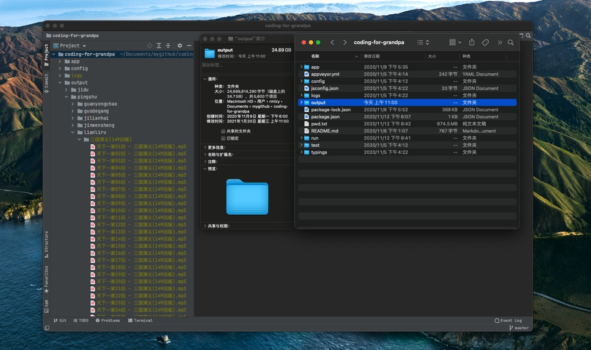

为爷爷写一些代码，抓取一些公开的评书、相声、戏剧资源。

目前抓取了单田芳、袁阔成、田连元、王玥波等表演艺术家的 1108 部作品。



爬虫运行了半小时，下载了 27G 左右的音频。

## 如何使用
```bash
# 安装依赖
npm i

# 启动开发服务
npm run dev
```

## 接口说明
```
# 抓取作者的全部书籍 + 章节 + 下载链接
http://127.0.0.1:1033/pingshu/fetch/lianliru

# 下载作者的全部书籍
http://127.0.0.1:1033/pingshu/fetch/lianliru
```

## 其他

`data/author.json` 为所有评书作者的作品链接。

```bash
# 查看 JSON 个数
ls -lR ./data|grep json|wc -l

# 查看文件夹大小
du -sh * | sort -rh
```

## 说明
所有资源均采集自网络，如有侵权，请联系我 rmlzy@outlook.com，我将第一时间移除。
